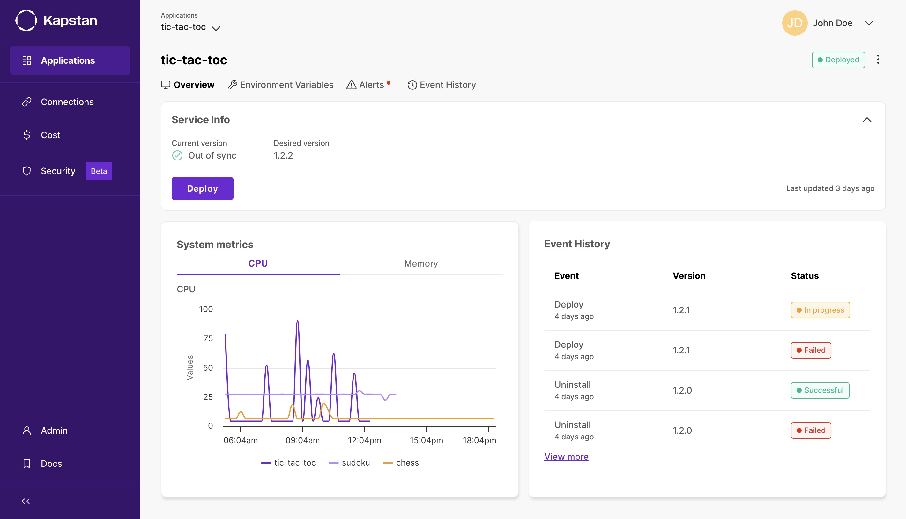

# Front-end Test for Duggup

Front-end assignment for Kapstan
Generated Project using Vite + react-ts. Components from MUI.

---

A lot of things were rushed due to lack of time. I have also disabled tsc for build because I couldn't get to fixing the issues in time. However the app is entirely functional.

---

[Live on Vercel](https://kapstan.vercel.app/)

---



---
### 💡 Running Locally

```bash
$ git clone git@github.com:Vynex/kapstan.git

$ cd kapstan
$ yarn

$ yarn dev
```